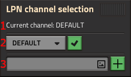
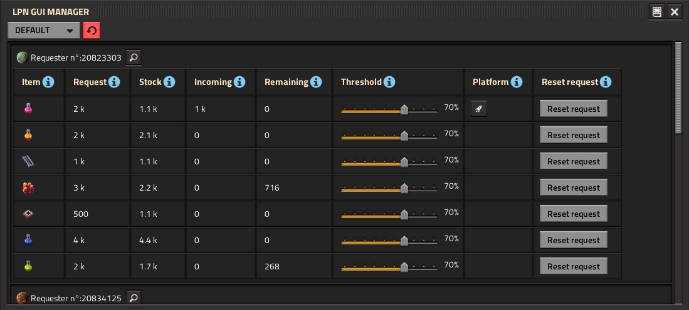

# Platform Logistics

Adds Requester and Provider for Space Platform in order to building a fully automated,Space Platform logistic network

## Installation

[Download on the Mod Portal.](https://mods.factorio.com/mod/Platform_logistics)

## Usage

### Definition Logistics Platform Network (LPN)

Create a Platform network :\
LPN Requester act as Requester chest.\
LPN Provider act as Passive provider chest.\
Space platform act as Logistics bot.\
\
Define request in LPN Requester (section or by circuitry).\
LPN Provider define providing item by read green and red signal.\
Platform are auto-scheduled to get items in LPN Provider and then deposit to the LPN Requester.\
:warning: In the LPN Requester if a section name contain signal :no_entry_sign: , the section are not handled by the network.

### Channel

LPN works with channel.\
Each channel works individualy. By default the "DEFAULT" channel is created.\
A new channel can be created in LPN Provider/LPN Requester/Space Platform GUI.\
By default new LPN Provider/LPN Requester/Space Platform are assign to the "DEFAULT" channel.\
You can assign a new channel in their GUI.\
1. The current channel.
2. Select and set entity on new channel.
3. Create a new channel.
\
### AUTO-SCHEDULE

To fullfill request the scedule of Space Platform are auto-set and always the same.\
A custom section with the format "LPN : Platform n° :" is created and contains all items requested for this platform.\
Wait conditions at LPN Provider station :
- Unloading enabled(so be careful)
- All requests satisfied
- Green-Signal = 1 (so you can make some circuitry if you want)
\
Wait conditions at LPN Requester station :
- Unloading enabled(of course)
- Inactivity = 5s
- Green-Signal = 1 (so you can make some circuitry if you want)
- when arriving at station : Space Platform section is update with all item request at 0 and for all items item = 0

### LPN GUI MANAGER

Let you manage your channels and see request and platform affected at